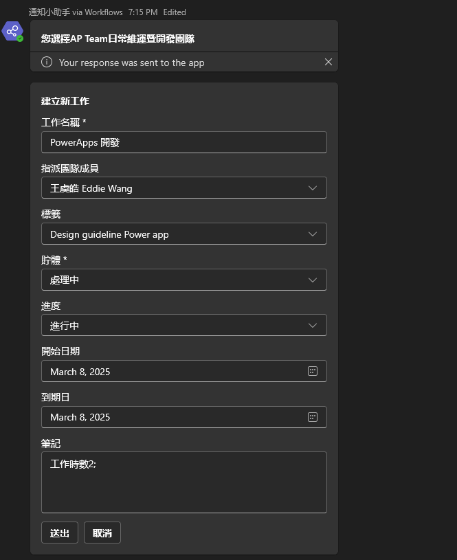
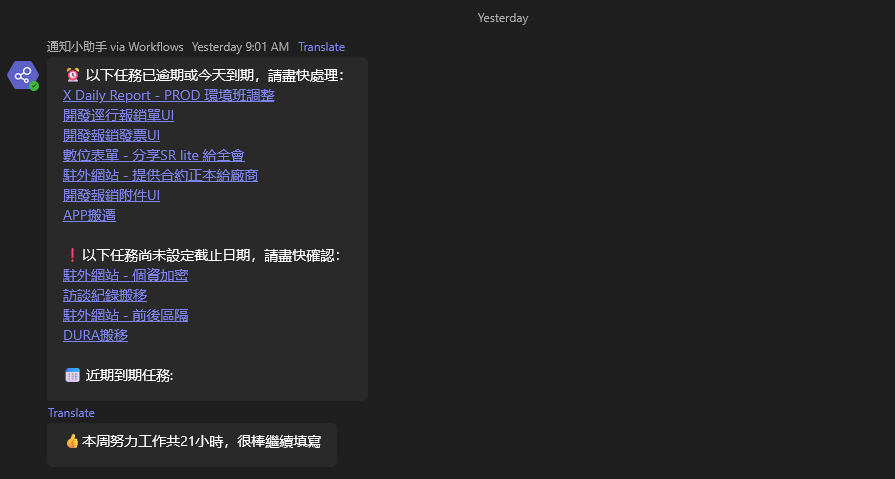

# TeamMate

## Project Overview
TeamMate is a Microsoft Teams integration powered by Power Automate that enhances the management of Microsoft Planner tasks, which the company uses similarly to JIRA tickets. This solution improves visibility, tracking, and automation of team workflows directly within the Teams environment, streamlining task management processes.

The system provides:
- Automated reminders and notifications to boost team productivity
- Task tracking and analytics to improve workflow visibility
- Proactive alerts for upcoming and overdue tasks
- Regular reporting on individual and team performances

## Key Features
- **Daily Task Creation Reminders**: Automated Teams messages prompting users to create and update Planner tasks.

- **Weekly Task Statistics**: Comprehensive reports summarizing task completion rates and team productivity.
- 
- **Overdue Task Alerts**: Proactive notifications about tasks approaching deadlines or already overdue.

- **Monthly Performance Analytics**: Detailed monthly summaries of Planner activity and team efficiency.

## Technical Implementation
TeamMate was developed using Microsoft's collaboration tools:
- **Microsoft Teams**: Serves as the central hub for task-related communications
- **Power Automate**: Powers the automated notifications and reporting system
- **Microsoft Planner**: Provides the task management foundation
- **Adaptive Cards**: Creates rich, interactive notifications within Teams
